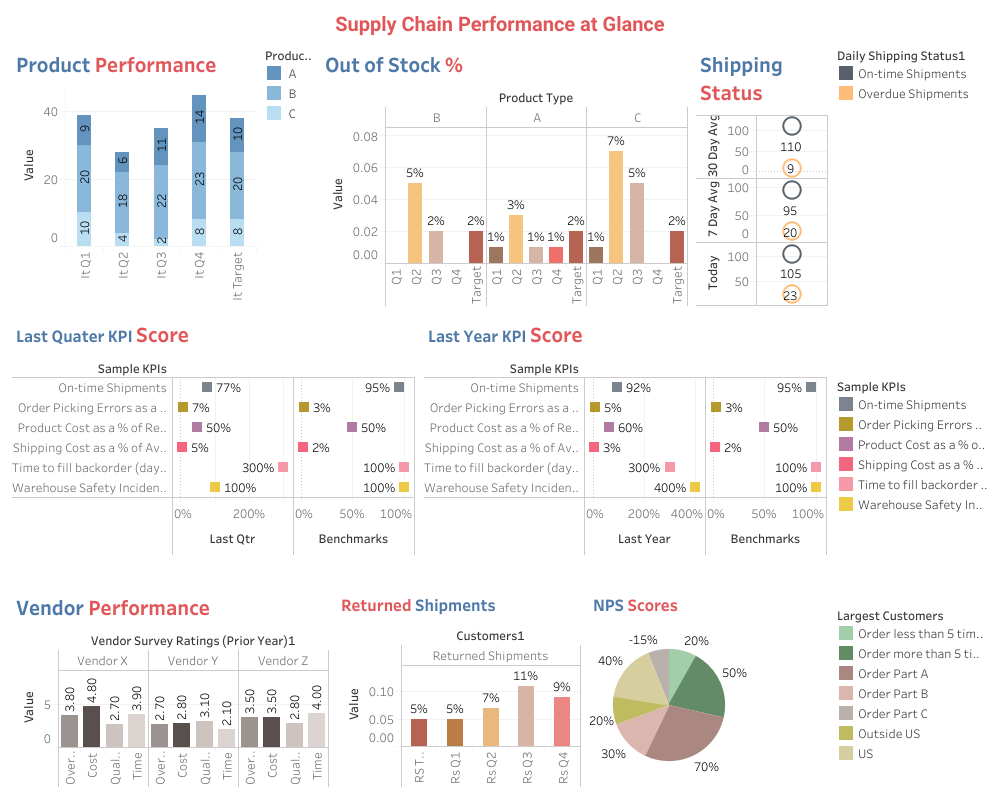

# Supply-Chain-dashboard
A Tableau Public dashboard for monitoring key supply chain metrics

## About the Dashboard

The "Supply Chain Performance at a Glance" dashboard provides a comprehensive overview of our supply chain's key performance metrics. It includes visualizations of product turnover, stock levels, shipping performance, vendor ratings, and customer satisfaction scores.

Key sections of the dashboard:
- **Product Performance**: Shows the turnover rate for each product and how often items are out of stock.
- **Shipping Status**: Monitors our on-time shipments versus overdue shipments on a daily, 7-day average, and 30-day average basis.
- **Vendor Performance**: Evaluates our vendors based on cost, quality, and delivery time.
- **Customer Satisfaction**: Includes Net Promoter Scores from different customer segments to gauge satisfaction levels.

